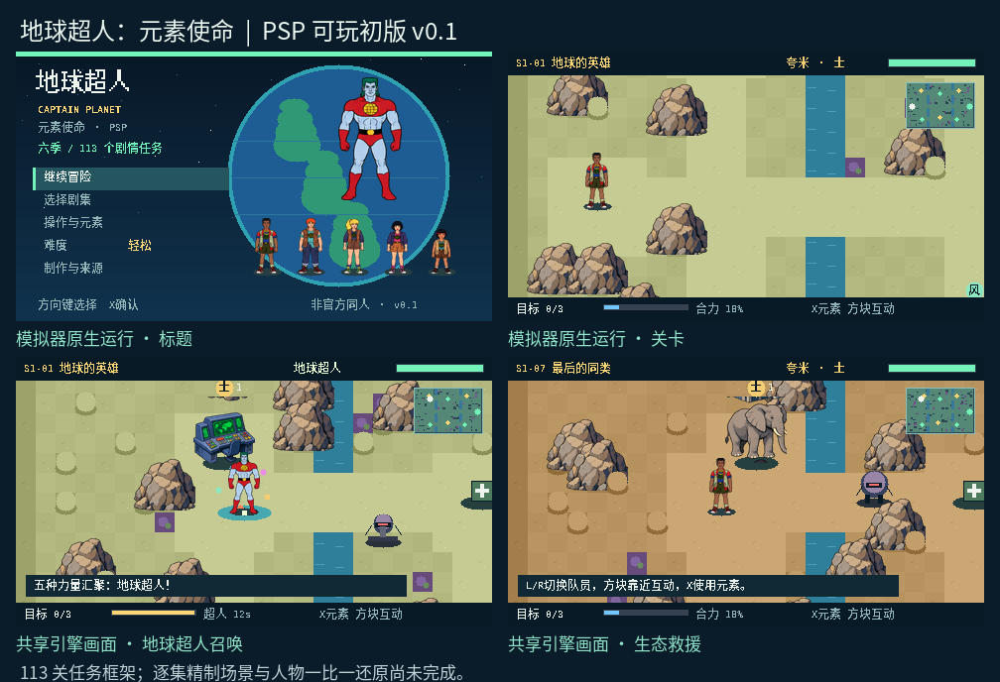

# 地球超人：元素使命 · Captain Planet PSP

**这个游戏由 ChatGPT-6 Astra 制作，Kyle 提出创意、玩法方向和还原要求。欢迎有兴趣的朋友一起帮忙优化！**

这是一个以《地球超人》动画为题材的非官方 PSP 同人冒险游戏项目。我们希望把六季动画逐步改编成可以在 PSP 上游玩的冒险关卡，并持续改善人物、场景、动作和故事表现。

目前提供 **v0.1 可玩初版**：原生 C / PSPSDK，480×272 中文界面，五位队员切换、元素攻击、召唤地球超人和存档系统。



## 下载与试玩

[下载 PSP v0.1 安装包](downloads/CaptainPlanet_PSP_v0.1.zip?raw=true)

解压后，将完整的 `PLANET` 文件夹复制到记忆棒的 `PSP/GAME/` 目录。请保留 `assets` 文件夹；运行需要支持自制程序的 PSP 环境。也可以在 PPSSPP 中打开 EBOOT.PBP。

[安装、按键和构建说明](docs/INSTALL_AND_BUILD.md) · [113 集任务映射](docs/EPISODE_MAP.md) · [测试报告](docs/BUILD_REPORT.md)

## 现在完成了什么

- 六季 113 个剧集条目及对应任务入口。
- 五位队员、五种元素与限时地球超人召唤。
- 停机、救援、调查、净化、护送等十类任务。
- 地图、难度、暂停、星级记录和自动存档。
- PSP 原生编译，以及模拟器启动、移动、暂停和素材加载验证。

**当前版本仍是原型。** 113 关基于共用任务框架和程序化地图，尚未逐集精制；剧情依据公开简介改编，没有逐集观看全部原片。人物是参考动画生成和整理的二维图集，尚未达到“一比一还原”。PSP 实机性能与全部关卡的完整战斗平衡仍待验证。

## 欢迎一起优化

无论你擅长编程、美术，还是喜欢《地球超人》、愿意在 PSP 上试玩，都欢迎通过 **Issues 提建议或报告问题，通过 Pull Requests 提交改进**。

我们尤其希望得到这些帮助：

1. **角色与动作**：校正原作人物比例、服装、发型，补充行走、攻击、受击和合体动画。
2. **关卡与剧情**：逐集核对原片，先把第一集做成更完整、好玩的示范关卡，再逐季扩展。
3. **场景与首领**：改善地图布局、环境细节，制作对应剧集的反派与首领机制。
4. **PSP 优化**：实机测试、帧率与内存优化、按键手感和存档可靠性。
5. **试玩反馈**：提供机型、运行环境、关卡编号、复现步骤和截图。

请先阅读 [贡献指南](CONTRIBUTING.md)。不要求一次完成很大的功能，一个明确的小修复也很有价值。

## 源码与构建

安装 PSPSDK，设置 `PSPDEV` 并将其 `bin` 目录加入 PATH，在项目根目录执行：

```sh
make
```

构建所需的预生成字体、剧集数据和图集已包含在仓库。详细的资源再生成与逻辑测试命令见 [构建说明](docs/INSTALL_AND_BUILD.md)。

## 项目说明

本项目由 Kyle 发起，初版游戏程序与制作工作由 ChatGPT-6 Astra 完成，后续欢迎社区共同改进。这是个人同人实验，不是 OpenAI 或原作权利人的官方项目。

《地球超人》的角色、名称和原作设定属于各自权利人。源码公开供查看与协作，不代表原作素材已获得商业授权。剧情资料来源、改写许可与字体许可见 [来源记录](docs/SOURCES.md) 和 [licenses](licenses)。
